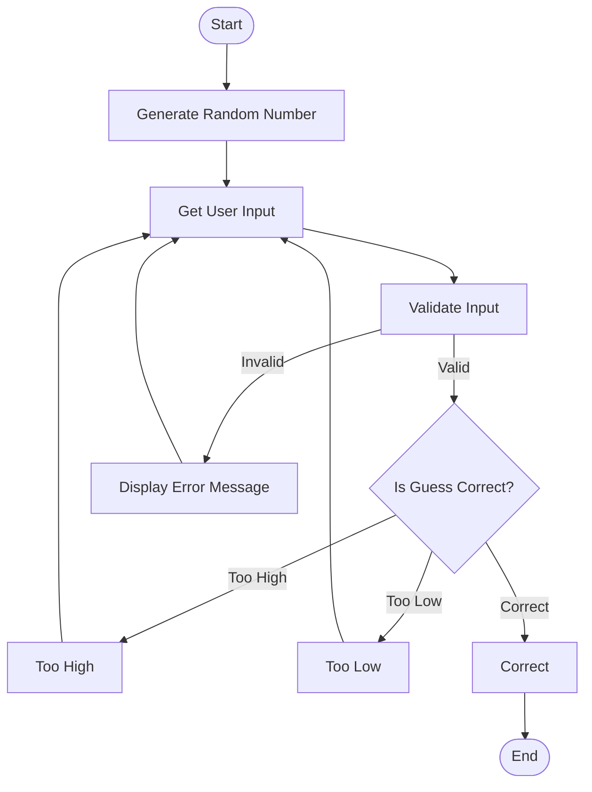

## Flowchart

## Description of the Diagram

The flowchart outlines the process of a random guessing game, starting from generating a random number, accepting and validating user input, providing feedback on the guess (too high, too low, or correct), and repeating the process until the user guesses correctly.

- Start: The program initializes and begins execution.
- Generate Random Number: A random number is generated within a predefined range (e.g., 1-100) to be guessed by the user.
- Get User Input: The program prompts the user to enter their guess.
- Validate Input: The input is checked to ensure it is a valid number within the acceptable range. If the input is invalid, an error message is displayed, and the program returns to the input prompt.
- Compare Guess: The program evaluates the user's guess against the generated number:
  - If the guess is correct, the program displays a success message and ends.
  - If the guess is too high, feedback is provided, and the user is prompted to guess again.
  - If the guess is too low, feedback is provided, and the user is prompted to guess again.
- End: The program concludes once the user correctly guesses the number.
